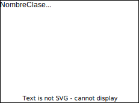
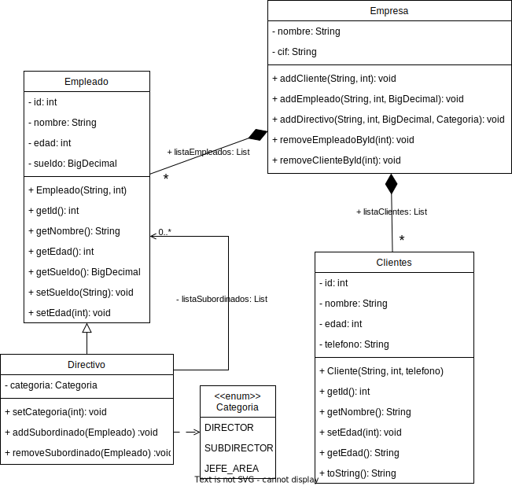

# Diagramas de clases con UML

## Ejemplos de diagramas de clases

## Ejercicios

### Ej01. Empleados de Empresa

- Una aplicación guardará información sobre empresa, empleados y clientes. Estos dos últimos se caracterizan por nombre y edad.
- Empleados tienen sueldo bruto, los empleados directivos tienen una categoría, así como un conjunto de empleados subordinados.
- Clientes a mayores se necesita conocer teléfono de contacto.
- Se necesita mostrar en la aplicación datos de empleados y clientes.

### Ej02. Biblioteca

- Una biblioteca tiene copias de libros.
- Los libros se caracterizan por su nombre, tipo (novela, teatro, poesía, ensayo), editorial, año y autor.
- Los autores se caracteriza por su nombre, nacionalidad y fecha de nacimiento.
- Cada copia tiene un identificador y puede estar en la biblioteca, prestada, con retraso o en reparación.
- Los lectores pueden tener un máximo de 3 libros en préstamo.
- Cada libro se presta un máximo de 30 días. Por cada día de retraso, se impone una "multa" de dos días sin posibilidad de coger un nuevo libro.
- Añadir los métodos necesarios para realizar el préstamo y devolución de libros.
  
  
## Otros
[Otras soluciones alternativas](https://docs.google.com/document/d/1pfv0W79IHCDnE_FVkoYkwZz4NSU_6orxhsdOEpPwayU/edit?usp=sharing)
